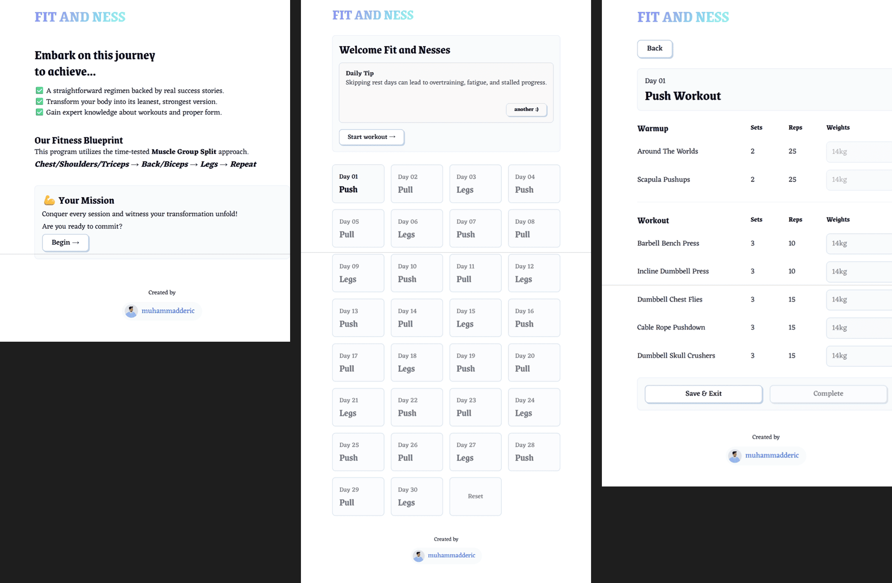

# Workout Fit and Ness

## Overview

**Workout Fit and Ness** is a web application used to create a gym plan and monitor your fitness progress.

## Features

### ✅ Current Features:
- Make gym plan in a day-by-day schema

## Installation

To get started with the **Workout Fit and Ness Web**, follow these steps:

1. **Clone the repository:**

    ```bash
    git clone https://github.com/muhammadderic/vue-workout-app.git
    cd vue-workout-app
    ```

2. **Install dependencies:**

    ```bash
    npm install
    ```

3. **Run the development server:**

    ```bash
    npm run dev
    ```

    Run [http://localhost:3000](http://localhost:3000) to see the pages.

## Screenshots

<div style="display: flex; justify-content: space-between;">
    
</div>

## Technologies Used

- **Vue** – Progressive JavaScript framework for building interactive UIs
- **TypeScript** – Strongly typed programming language that builds on JavaScript

## Contributing

Contributions are welcome! If you'd like to contribute to this project, please follow these steps:

1. Fork the repository.
2. Create a new branch for your feature or bugfix.
3. Commit your changes and push your branch.
4. Open a pull request to have your changes reviewed.

## License

This project is licensed under the MIT License. See the [LICENSE](LICENSE) file for more details.

## Contact

If you have any questions or suggestions, feel free to reach out:

- **GitHub**: [muhammadderic](https://github.com/muhammadderic)
